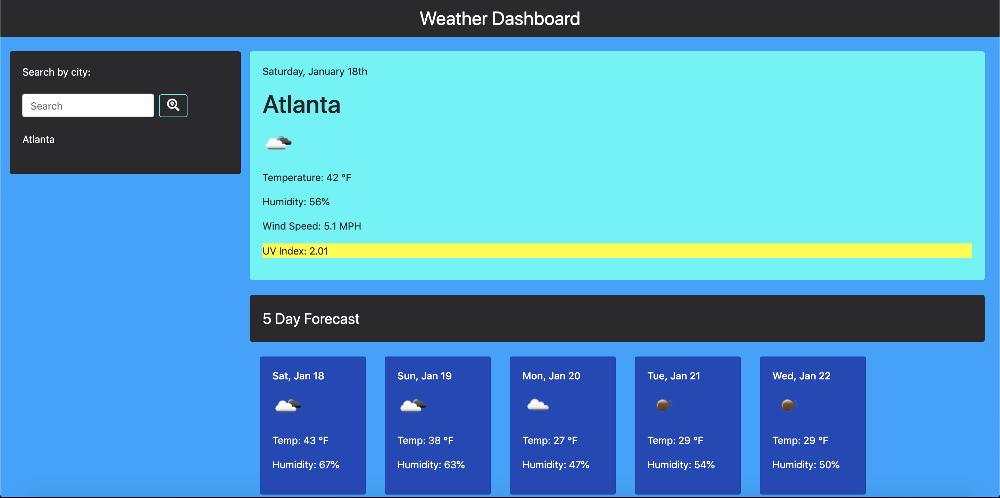

# Weather Dashboard

## Links

https://drewhowell.github.io/weatherdashboard/

## Purpose
Developers are often tasked with retrieving data from another application's API and using it in the context of their own. Third-party APIs allow developers to access their data and functionality by making requests with specific parameters to a URL. In this homework assignment, my challenge was to build a weather dashboard using the OpenWeather API.

## Description
This weather dashboard application has search functionality to find current weather conditions and future weather outlook for multiple cities.

This app uses the OpenWeather API to retrieve weather data for cities. It runs in the browser and features dynamically updated HTML and CSS powered by jQuery.

It displays the following current weather conditions:
-City
-Date
-Icon image (visual representation of weather conditions)
-Temperature
-Humidity
-Wind speed
-UV index

It also inncludes a search history so that users can access their past search terms. Clicking on the city name performs a new search that returns current and future conditions for that city.

Lastly, this app includes a 5-Day Forecast below the current weather conditions.

Each day for the 5-Day Forecast displays the following:
-Date
-Icon image (visual representation of weather conditions)
-Temperature
-Humidity

## Images

